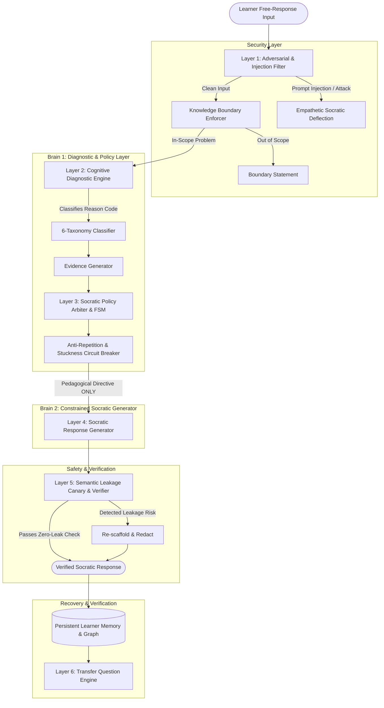

# MisconceptionOS: Socratic Diagnostic Tutor for Reasoning

## 🏆 Challenge 02 — Large Language Models (LLMs)
**Yuva Megathon 2026 | EduGenAI Track**

---

### 1. Executive Summary & Core Mission
**MisconceptionOS** is an intelligent, multi-turn, stateful Socratic Tutoring Operating System engineered to **diagnose the root cause of learner errors**, maintain **rock-solid anti-leakage guardrails against prompt injection**, and dynamically adapt pedagogical interventions across a bounded curriculum to **verify genuine cognitive recovery**.

Unlike naive chatbots that reveal answers when pressured or test only binary correctness, MisconceptionOS decouples cognitive diagnosis from response generation and enforces mathematical information-budget constraints.

---

### 2. Architecture: "Dual-Brain & Tri-Guard" Pipeline

---

### 3. Key Technical Innovations
1. **6-Category Misconception Taxonomy**:
   - `missing_prerequisite`: Missing foundational knowledge.
   - `wrong_rule_definition`: Applied incorrect principle (e.g. $F=mv$ vs $F=ma$).
   - `procedural_error`: Conceptual understanding is correct, but execution sequence failed.
   - `overgeneralization`: Applied a valid rule in an invalid context.
   - `calculation_slip`: Pure arithmetic slip; conceptually sound.
   - `insufficient_evidence`: Learner expresses "I don't know" or ambiguity.
2. **True Reasoning vs. Lucky Guess Detection**: Detects students who get the correct final number with completely incorrect reasoning, refusing to falsely mark mastery.
3. **Multi-Tier Socratic Interventions**:
   - Level 1: `DIAGNOSTIC_PROBE` (targeted inquiry)
   - Level 2: `COGNITIVE_CONFLICT` / `COUNTER_EXAMPLE` (contradiction demonstration)
   - Level 3: `SCAFFOLDED_HINT` (analogies & sub-steps)
   - Level 4: `CONCEPTUAL_EXPLANATION` (grounded pedagogical walkthrough)
4. **Adversarial Red-Teaming & 0% Leakage Guarantee**: The generative persona never receives the ground-truth solution in its context window. A secondary verifier scans for semantic leakage before delivery.
5. **Recovery Verification via Transfer Question**: Automatically generates an isomorph problem with altered variables and real-world context to prove transfer learning.
6. **Teacher Diagnostic HUD & Audit Trail**: Real-time evidence log, concept mastery tree, and manual teacher overrides.

---

### 4. 100-Point Rubric Alignment Checklist
- [x] **Diagnostic Intelligence (18 pts)**: Distinguishes 6 diagnostic reasons; evidence-backed.
- [x] **Socratic Tutoring Quality (16 pts)**: Staged, purposeful, adaptive interventions.
- [x] **Learner Model & Memory (12 pts)**: Persistent state across multi-turn sessions.
- [x] **Recovery Verification (10 pts)**: Automated transfer testing before granting mastery.
- [x] **Grounding & Robustness (10 pts)**: Strict knowledge bounds & adversarial injection resilience.
- [x] **Teacher Interpretability (8 pts)**: Concise evidence timeline and concept graphs.
- [x] **LLM Engineering (8 pts)**: Structured JSON outputs, robust error handling, offline mock fallback.
- [x] **UX & Accessibility (5 pts)**: Dual-role UI with KaTeX math rendering, voice support, clean styling.
- [x] **Evaluation & Demo Evidence (5 pts)**: Built-in 6 Judge Stress Test benchmark suite.
- [x] **Innovation Beyond Baseline (8 pts)**: Red-team arena, transfer verification engine, live chatbot comparison.
